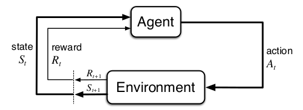
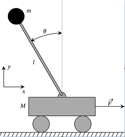

# Reinforcement Learning

## Motivation

    This subject got the attention of our group since the first class we’ve heard about it. Not because it is new, 
    once the first approach to solving this kind of problems dates from the ’70s (Witten 1977). Now it is possible 
    to deal with the curse of dimensionality (Bellman, 1957) using parallelism, GPUs/TPUs and has many uses not 
    explored yet, also many pitfalls. So we decide to choose it even knowing the task will be very difficult to 
    accomplish the way we want due to the few time available to perform it. When we faced the problem of training
    this kind of algorithm, The learning about the different techniques and strategies was reached.

## Reinforcement Learning – the third way

    Different from the previous Machine learning paradigms the Supervised and Unsupervised Learning where we have 
    many data annotated to teach a neuron network to achieve a goal on the first, and learn the behavior of the few
    not annotated input data on the second. The Reinforcement Learning approach does not require a lot of data to 
    training an algorithm to achieve a goal, because it generates this data on the fly in a dynamic way.
    Sutton, R. S. brings a good definition of reinforcement learning “… Reinforcement learning is learning what 
    to do—how to map situations to actions—so as to maximize a numerical reward signal. The learner is not told 
    which actions to take, but instead must discover which actions yield the most reward by trying them...”
    In this context, the subject which will learn how to map situations to actions is called agent. This agent will
    act on an environment, and this environment will provide him state observations and rewards. This approach is 
    modeled mathematically as a Markov Decision Process as figure below.

##  OpenAI Gym CartPole

    A laboratory example wrote by Victor Campos which we have to execute during the course gave origin to this work.
    Originally it was written in TensorFlow and solve the Cart Pole problem. The Cart Pole is a trivial problem used
    in reinforcement learning, where an agent has only two possible actions to take, i.e. move a cart to the right
    or move it to the left to balance a pole on top of this cart. The pole is free to fall, but the problem is 
    simplified to just one dimension this way the cart moves and the pole can fall in one dimension: right or left.

    
    OpenAI modeled this Cart Pole problem in an environment “CartPole-v0” that is part of gym toolkit. OpenAI 
    is a company who is ahead of the Reinforcement Learning field making the Artificial Intelligence accessible to 
    everyone and creating through Gym toolkit the metrics and ways to compare the efficiency of learning algorithms
    once their performance is not comparing the same way as the ones who deal with CNN- Convolutional neuronal 
    networks using images databases. They design environments in Gym to work with control problems, games, 
    robotics and automation problems and OpenAI controls their versions. You can train an agent in a built 
    environment or design a new environment based on their models. We choose to use CartPole-v0 to compare our
    solution with the Victor Campos solution.

## CartPole Environment

    The CartPole-v0 is an environment created by Sutton, Barto & Anderson which has as Set of possible actions a 
    discrete variable who can have the value 0 standing for the move to left and 1 for the move to the right. 
    Moreover, a set of environments observations which are the way our agent see the environment, and we call it
    states. It is a vector of 4 float values that stores in this order: the position of the cart, the velocity of
    the cart, the angle the pole is making with the normal direction (vertical) and the velocity of the pole edge.
    The environment simulates the physics of the problem through a Euler kinematic integrator and gives the 
    agent the reward of one unit per step if the pole angle is not superior to 12º and the cart position, its center,
    is not reaching the edge of the screen (+/-2.4). Every time these conditions have not reached the environment
    finishes this temporal simulation, which is called episode, not rewarding the agent for this last step. If the 
    agent chooses the correct action successfully balancing the pole in this environment for 200 consecutive time 
    units, then the episode is done too. To  Solve the training of an agent in gym CartPole-v0 environment the 
    average reward should be greater or equal to 195 over the last 100 trials.

## The Project proposal

    We decided to start from Victor Campos solution design different solutions wrote in Pytorch, who tries to 
    solve the cart pole problem using DQN and Policy Gradient using images from gym environment as input instead 
    of the observation float vector.
    The respective codes below shows the Policy concept, the Deep Q-Network and the tradeoff between exploration 
    and exploitation.
