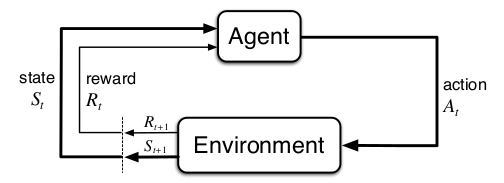
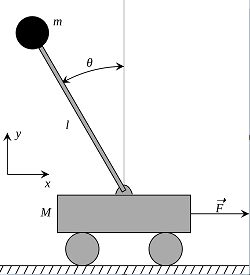
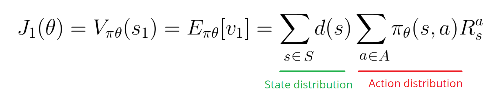
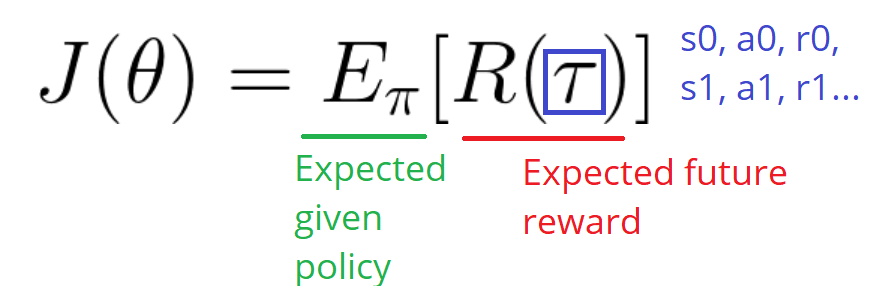
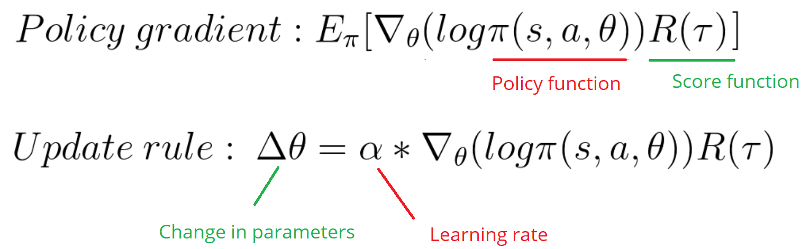

# Introduction to Reinforcement Learning

## Motivation

    This subject got the attention of our group since the first class we’ve heard about it. Not because it is new, once the first approach to solving this kind of problems dates from the ’70s (Witten 1977). Now it is possible to deal with the curse of dimensionality (Bellman, 1957) using parallelism, GPUs/TPUs and has many uses not explored yet, also many pitfalls. So we decide to choose it even knowing the task will be very difficult to accomplish the way we want due to the few time available to perform it. When we faced the problem of training this kind of algorithm, The learning about the different techniques and strategies was reached.

## Reinforcement Learning – the third way

    Different from the previous Machine learning paradigms the Supervised and Unsupervised Learning where we have many data annotated to teach a neuron network to achieve a goal on the first, and learn the behavior of the few not annotated input data on the second. The Reinforcement Learning approach does not require a lot of data to training an algorithm to achieve a goal, because it generates this data on the fly in a dynamic way.
    Sutton, R. S. brings a good definition of reinforcement learning “… Reinforcement learning is learning what to do—how to map situations to actions—so as to maximize a numerical reward signal. The learner is not told which actions to take, but instead must discover which actions yield the most reward by trying them...”
    In this context, the subject which will learn how to map situations to actions is called agent. This agent will act on an environment, and this environment will provide him state observations and rewards. This approach is modeled mathematically as a Markov Decision Process as figure 1.



 ##  Reinforcement Learning – OpenAI Gym

    A laboratory example wrote by Victor Campos which we have to execute during the course gave origin to this work. Originally it was written in TensorFlow and solve the Cart Pole problem. The Cart Pole is a trivial problem used in reinforcement learning, where an agent has only two possible actions to take, i.e. move a cart to the right or move it to the left to balance a pole on top of this cart. The pole is free to fall, but the problem is simplified to just one dimension this way the cart moves and the pole can fall in one dimension: right or left. Fig2.
    OpenAI modeled this Cart Pole problem in an environment “CartPole-v0” that is part of gym toolkit.  OpenAI is a company who is ahead of the Reinforcement Learning field making the Artificial Intelligence accessible to everyone and creating through Gym toolkit the metrics and ways to compare the efficiency of learning algorithms once their performance is not comparing the same way as the ones who deal with CNN- Convolutional neuronal networks using images databases. They design environments in Gym to work with control problems,  games, robotics and automation problems and OpenAI controls their versions. You can train an agent in a built environment or design a new environment based on their models. We choose to use CartPole-v0 to compare our solution with the Victor Campos solution.
    The CartPole-v0 is an environment created by Sutton, Barto & Anderson which has as Set of possible actions a discrete variable who can have the value 0 standing for the move to left and 1 for the move to the right. Moreover, a set of environments observations which are the way our agent see the environment, and we call it states. It is a vector of 4 float values that stores in this order: the position of the cart, the velocity of the cart, the angle the pole is making with the normal direction (vertical) and the velocity of the pole edge. The environment simulates the physics of the problem through a Euler kinematic integrator and gives the agent the reward of one unit per step if the pole angle is not superior to 12º and the cart position, its center, is not reaching the edge of the screen (+/-2.4). Every time these conditions have not reached the environment finishes this temporal simulation, which is called episode, not rewarding the agent for this last step. If the agent chooses the correct action successfully balancing the pole in this environment for 200 consecutive time units, then the episode is done too. To  Solve the training of an agent in gym CartPole-v0 environment the average reward should be greater or equal to 195 over the last 100 trials.



## The Project proposal

    We decided to start from Victor Campos solution design different solutions wrote in Pytorch, who tries to solve the cart pole problem using DQN and Policy Gradient using images from gym environment as input instead of the observation float vector.
    The respective codes below shows the Policy concept, the Deep Q-Network and the tradeoff between exploration and exploitation.

# Deep Stochastic Policy Gradient Agent

## Deterministic vs Stochastic

Depending on how the policy is defined classify agents as:
* Deterministic: Outputs the action the agent will execute for a given state. Value-based agents such as DQN are exmples of deterministic agents.

* Stochastic: Outputs a probability distribution over actions. The action executed is sampled from this distribution

## Policy definition:
We wont our policy to learn the probability distribution for a given state, this will be achieved using a fully connected neural network

What to learn?


Who will learn it? Our model


```python
# Pytorch policy definition
class PolicyNN(nn.Module):
  def __init__(self,obs_dim=4, num_actions=2):
    super(PolicyNN, self).__init__()
    self.fc1 = nn.Sequential(
      nn.Linear(obs_dim, 16),
      nn.Tanh())
    self.fc2 = nn.Sequential(
      nn.Linear(16, 16),
      nn.Tanh())
    self.fc3 =  nn.Linear(16, num_actions)

  def forward(self, x):
    x = self.fc1(x)
    x = self.fc2(x)
    logprobs = self.fc3(x)
    return F.softmax(logprobs)
}
```


That's perfect, but how do we know how good is our policy? 

As it is an optimization problem we need to find a mesure to minimize/maximize and update our policy accordingly.


## Policy Optimization:
Basic definitions:


How to train the policy:

1. Measure the quality of a π (policy) that has parameters θ with a policy score function J(θ) 
2. Use policy gradient ascent to find the best parameter θ that improves our π
    

Defining J(θ):

The main idea behind reinforcement learning is the idea of the reward hypothesis. It says that all goals can be descibed by the maximization of the expected cumulative reward:

- We can define the policy score as the expected reward of following π for every possible state:



We know that policy parameters change how actions are chosen, and as a consequence, what rewards we get and which states we will see and how often.
On the other hand, the impact of the policy in the state distribution is not that obvious, moreover the environment is unknown


The solution will be to use the Policy Gradient Theorem. This provides an analytic expression for the gradient ∇ of J(θ) (performance) with respect to policy θ that does not involve the differentiation of the state distribution.

Differentiable score policy function:



Now we can compute the compute the gradient as:




# DQN Agent

balblabalba


# Conclusions

balblabalba

```js
// Javascript code with syntax highlighting.
var fun = function lang(l) {
  dateformat.i18n = require('./lang/' + l)
  return true;
}
```

```ruby
# Ruby code with syntax highlighting
GitHubPages::Dependencies.gems.each do |gem, version|
  s.add_dependency(gem, "= #{version}")
end
```

#### Header 4

*   This is an unordered list following a header.
*   This is an unordered list following a header.
*   This is an unordered list following a header.

##### Header 5

1.  This is an ordered list following a header.
2.  This is an ordered list following a header.
3.  This is an ordered list following a header.

###### Header 6

| head1        | head two          | three |
|:-------------|:------------------|:------|
| ok           | good swedish fish | nice  |
| out of stock | good and plenty   | nice  |
| ok           | good `oreos`      | hmm   |
| ok           | good `zoute` drop | yumm  |

### There's a horizontal rule below this.

* * *

### Here is an unordered list:

*   Item foo
*   Item bar
*   Item baz
*   Item zip

### And an ordered list:

1.  Item one
1.  Item two
1.  Item three
1.  Item four

### And a nested list:

- level 1 item
  - level 2 item
  - level 2 item
    - level 3 item
    - level 3 item
- level 1 item
  - level 2 item
  - level 2 item
  - level 2 item
- level 1 item
  - level 2 item
  - level 2 item
- level 1 item

### Small image


### Large image


### Definition lists can be used with HTML syntax.

<dl>
<dt>Name</dt>
<dd>Godzilla</dd>
<dt>Born</dt>
<dd>1952</dd>
<dt>Birthplace</dt>
<dd>Japan</dd>
<dt>Color</dt>
<dd>Green</dd>
</dl>

```
Long, single-line code blocks should not wrap. They should horizontally scroll if they are too long. This line should be long enough to demonstrate this.
```

```
The final element.
```
