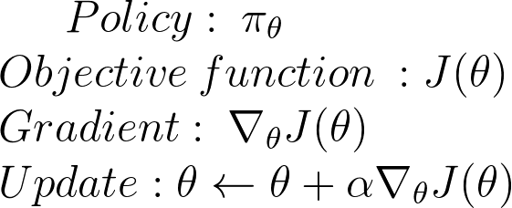

# Introduction to Reinforcement Learning

bla bla bla intro

# Deep Stochastic Policy Gradient Agent

## Deterministic vs Stochastic

Depending on how the policy is defined classify agents as:
* Deterministic: Outputs the action the agent will execute for a given state. Value-based agents such as DQN are exmples of deterministic agents.

* Stochastic: Outputs a probability distribution over actions. The action executed is sampled from this distribution

## Policy definition:
We wont our policy to learn the probability distribution for a given state, this will be achieved using a fully connected neural network

What to learn?


Who will learn it? Our model


```python
# Pytorch policy definition
class PolicyNN(nn.Module):
  def __init__(self,obs_dim=4, num_actions=2):
    super(PolicyNN, self).__init__()
    self.fc1 = nn.Sequential(
      nn.Linear(obs_dim, 16),
      nn.Tanh())
    self.fc2 = nn.Sequential(
      nn.Linear(16, 16),
      nn.Tanh())
    self.fc3 =  nn.Linear(16, num_actions)

  def forward(self, x):
    x = self.fc1(x)
    x = self.fc2(x)
    logprobs = self.fc3(x)
    return F.softmax(logprobs)
}
```


That's perfect, but how do we know how good is our policy? 

As it is an optimization problem we need to find a mesure to minimize/maximize and update our policy accordingly.


## Policy Optimization:
Basic definitions:




How to train the policy:

1. Measure the quality of a π (policy) that has parameters θ with a policy score function J(θ) 
2. Use policy gradient ascent to find the best parameter θ that improves our π
    

Defining J(θ):

The main idea behind reinforcement learning is the idea of the reward hypothesis. It says that all goals can be descibed by the maximization of the expected cumulative reward:


# DQN Agent

balblabalba


# Conclusions

balblabalba

```js
// Javascript code with syntax highlighting.
var fun = function lang(l) {
  dateformat.i18n = require('./lang/' + l)
  return true;
}
```

```ruby
# Ruby code with syntax highlighting
GitHubPages::Dependencies.gems.each do |gem, version|
  s.add_dependency(gem, "= #{version}")
end
```

#### Header 4

*   This is an unordered list following a header.
*   This is an unordered list following a header.
*   This is an unordered list following a header.

##### Header 5

1.  This is an ordered list following a header.
2.  This is an ordered list following a header.
3.  This is an ordered list following a header.

###### Header 6

| head1        | head two          | three |
|:-------------|:------------------|:------|
| ok           | good swedish fish | nice  |
| out of stock | good and plenty   | nice  |
| ok           | good `oreos`      | hmm   |
| ok           | good `zoute` drop | yumm  |

### There's a horizontal rule below this.

* * *

### Here is an unordered list:

*   Item foo
*   Item bar
*   Item baz
*   Item zip

### And an ordered list:

1.  Item one
1.  Item two
1.  Item three
1.  Item four

### And a nested list:

- level 1 item
  - level 2 item
  - level 2 item
    - level 3 item
    - level 3 item
- level 1 item
  - level 2 item
  - level 2 item
  - level 2 item
- level 1 item
  - level 2 item
  - level 2 item
- level 1 item

### Small image


### Large image


### Definition lists can be used with HTML syntax.

<dl>
<dt>Name</dt>
<dd>Godzilla</dd>
<dt>Born</dt>
<dd>1952</dd>
<dt>Birthplace</dt>
<dd>Japan</dd>
<dt>Color</dt>
<dd>Green</dd>
</dl>

```
Long, single-line code blocks should not wrap. They should horizontally scroll if they are too long. This line should be long enough to demonstrate this.
```

```
The final element.
```
