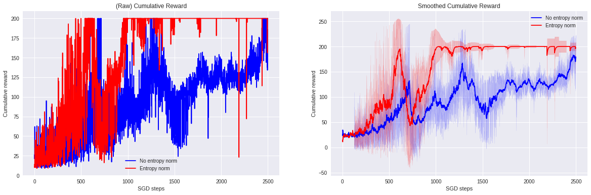

# Experimenting with Reinforce algorithm: Deep Policy Gradient Agent

After adapting the code from Victor Campos (DLAI lab) to PyTorch we started modifying some hyperparameters/architecture.
Here you can find a small resume of the most representative experiments:

## Observations as current state 

### Activation function: ReLU vs TanH
relu_vs_tanh.png
Basic Deep Policy Gradient Agent with lr=0.001 using a 3 layer FC network.

As can be seen in the following image, the policy which uses ReLU activations needs more episodes to perform as good as the one with tanh activations. However, ReLU agent shows a better convergence at the end of the training.
It can be explained by the information ReLU is dropping (0ing everything below 0).

### Entropy normalization
Exploration is one of the problems one has to face when working on reinforcement learning. Intuitively, encouraging our agent to explore the environment can improve the speed of the training and avoid falling in non-optimal local minima.
More information can be found in the following paper:
Understanding the impact of entropy on policy optimization, Zafarali Ahmed, Nicolas Le Roux, Mohammad Norouzi, Dale Schuurmans
(Submitted on 27 Nov 2018 (v1), last revised 29 Nov 2018 (this version, v2)) 

After implementing entropy normalization with a constant value we can see the following results:
Entropy factor=0.01

By encouraging the exploring we can see that the entropic agent learns faster and also finds a more opotimal solution than the version without entropy normalization.
When training policy gradient agents we should take entropy normalization as another parameter which we can leave constant or try expontential decays on the entropy factor.

## RGB Image as current state
When changing the state from the environment 4 dim feature vector to an RGB image the complexity of the problem increases exponientially. The function our network has to learn is still the same, but understanding the state becomes such a challenge for our network.

On the first attempts our agent is just moving to one direction and gradients vanish in less than thousand episodes. Each experiment takes now around 1.5-2h to fulfill a 3k episodes training, it is solowing our development and we do not have enough resources to make a hyperparameters grid search.

In order to work with images we will change the previous fully connected network to a CNN +FC softmax output.

Using images as input our agent does not even get near solving the enviroment

